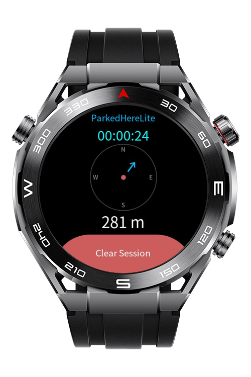

> **Note:** To access all shared projects, get information about environment setup, and view other guides, please visit [Explore-In-HMOS-Wearable Index](https://github.com/Explore-In-HMOS-Wearable/hmos-index).

# ParkedHereLite

A parking location tracker with visual navigation for Huawei LiteOS wearable devices.

# Preview

<div style="display:flex;flex-wrap:wrap;gap:10px;justify-content:center;">
  
  
  
</div>

# Use Cases

- **Parking Tracking:** Never forget where you parked.
- **Urban Parking** Monitor time for parking meters or time-limited zones.
- **Events & Venues:** Find your way back in crowded events.
- **Outdoor Activities:** Track distance and time from starting point.

# Technology

## Stack

- **Platform:** Huawei LiteOS (Lite Wearable)
- **Language:** Javascript
- **Framework:** Huawei Lite Wearable JS Framework
- **SDK Version:** 5.0.0(12) - 5.1.0(18)
- **Canvas API:** CanvasRenderingContext2D (with LiteOS limitations)
- **APIs Used:**
  - `@system.geolocation` - GPS location tracking
  - `@system.storage` - Local data persistence
  - `@system.vibrator` - Haptic feedback for proximity alerts


## Features

- **Visual Navigation Compass**: Rotating arrow on canvas that points toward your parked location
- **Elapsed Timer**: Track time since parking (hh:mm:ss format)
- **Real-Time Distance**: See distance to parked location in meters/kilometers
- **Proximity Alert**: Haptic feedback when very close
- **Session Persistence**: Resume tracking after app restart with stored location


# Directory Structure

```
ParkedHereLite/
│
├── entry/
│   └── src/
│       └── main/
│           ├── js/
│           │   └── MainAbility/
│           │       ├── app.js                    # Application Lifecycle
│           │       ├── common/
│           │       │   └── calculate_distance.js # Distance calculation (Haversine formula)
│           │       │   └── calculate_bearing.js  # Bearing calculation (0 to 360)
│           │       │   └── format_time.js        # Time formatter(hh:mm:ss)
│           │       └── pages/
│           │           ├── index/                # Main Parking Tracker Page
│           │           │   ├── index.css
│           │           │   ├── index.hml
│           │           │   └── index.js
│           ├── resources/
│           │   └── base/
│           │       ├── element/
│           │       │   └── string.json           # Resource Strings
│           │       └── media/
│           └── config.json                       # Entry config file
```

# Constraints and Restrictions

## Supported Devices;

- Huawei Sport (Lite) Watch GT 4/5/6
- Huawei Sport (Lite) GT4/5 Pro
- Huawei Sport (Lite) Fit 3/4
- Huawei Sport (Lite) D2
- Huawei Sport (Lite) Ultimate

# License

**ParkedHereLite** is distributed under the terms of the MIT license. See the [LICENSE](LICENSE) for more information.
